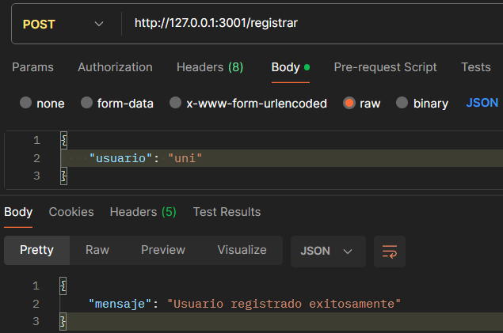
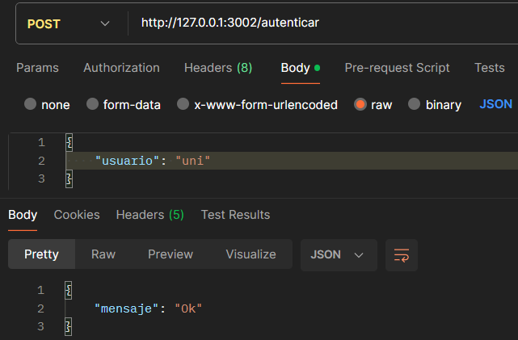
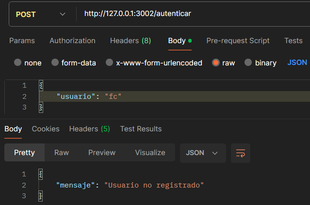
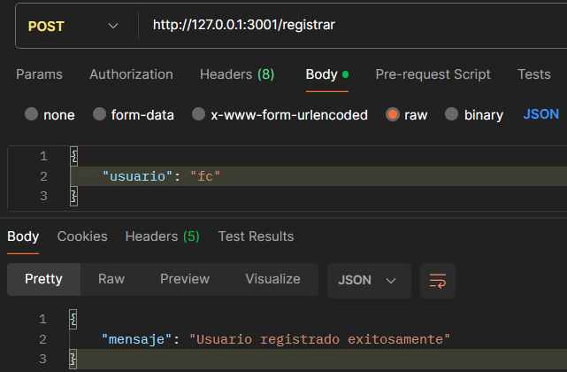
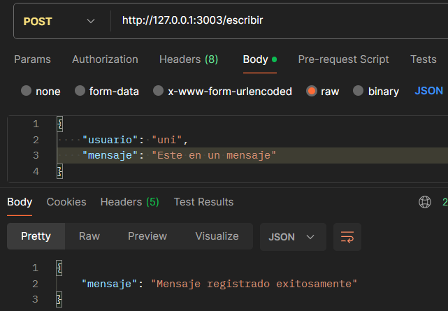
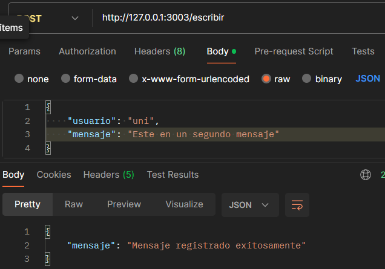
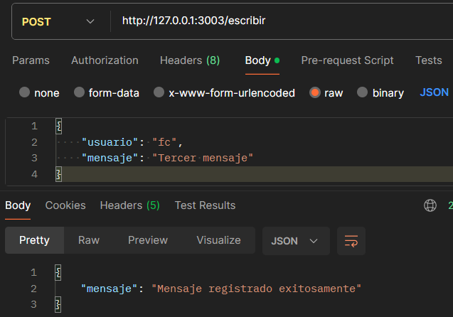
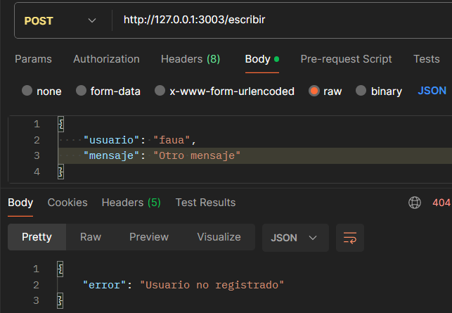
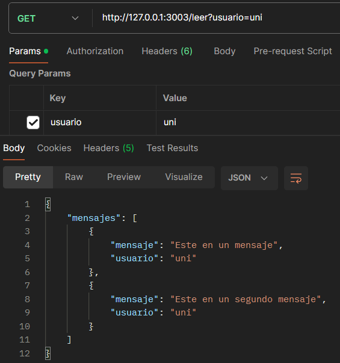

# Requisitos

Se deben tener instaladas las librerías necesarias de Python en el sistema. Con el siguiente comando se puede instalarlas o verificar que ya lo estén:
```bash
pip install flask tinydb requests
```

---

# Levantar las APIs

Se deben levantar las APIs mediante consola ejecutando los respectivos comandos en cada bash distinto:

1. Levantar la 1ra API
   ```bash
   python3 registro.py
   ```
2. Levantar la 2da API
   ```bash
   python3 autenticacion.py
   ```
3. Levantar la 3ra API
   ```bash
   python3 mensaje.py
   ```

---

# Estructura

### API 1 (Registro)
- **Puerto:** `3001`
- **Descripción:**  
  La primera API consistirá en una API de Registro, a la cual se le enviará en una solicitud POST un campo denominado usuario que contendría una cadena de texto el cual servirá de cuenta o identificador, esta API recibirá la solicitud y guardará el usuario en una base de datos, archivo de texto o similar.

### API 2 (Autenticación)
- **Puerto:** `3002`
- **Descripción:**  
  La segunda API será de Autenticación, también recibirá una solicitud POST, en la que se incluirá el usuario, la API recibirá el texto y lo buscará dentro del archivo de información generado en el registro, si el usuario ya se encuentra guardado retornará su aprobación con un “Ok” caso contrario retornará “Usuario no Registrado”.

### API 3 (Mensajes: escritura y lectura)
- **Puerto:** `3003`
- **Descripción:**  
  La tercera API será similar a un buzón o registro de mensajes y tendrá dos endpoints, el primer endpoint será uno de escritura, recibirá dos atributos el usuario junto con un mensaje, y así mismo guardará ambos en una base de datos o similar, el segundo endpoint será de lectura también necesitará recibir el nombre de usuario que leerá los mensajes y retornará al cliente que realizó la solicitud el total de mensajes registrados, siempre tomando en cuenta para ambos endpoints, que el usuario que realice la solicitud se encuentre registrado, llamando internamente a la API de Autenticación.

---

# Llamadas a la API

### Opción 1
Hacer las consultas desde consola con `curl`:
```bash
curl -X POST http://127.0.0.1:3001/registrar -H "Content-Type: application/json" -d "{\"usuario\": \"usuario\"}"

```


### Opción 2
Hacer las consulta mediante [Postman](https://www.postman.com/) a los respectivos endpoints de las APIs.

---

# Ejemplo (`curl`)

### Registrar
```bash
 curl -X POST http://127.0.0.1:3001/registrar -H "Content-Type: application/json" -d "{\"usuario\": \"usuario\"}"
{
  "mensaje": "Usuario registrado exitosamente"
}
```

### Autenticar
```bash
 curl -X POST http://127.0.0.1:3002/autenticar -H "Content-Type: application/json" -d "{\"usuario\": \"usuario\"}"
{
  "mensaje": "Ok"
}
```


### Escribir
```bash
 curl -X POST http://127.0.0.1:3003/escribir -H "Content-Type: application/json" -d "{\"usuario\": \"usuario\", \"mensaje\": \"mensaje de prueba\"}"
{
  "mensaje": "Mensaje registrado exitosamente"
}
```


### Leer
```bash
 curl -X GET "http://127.0.0.1:3003/leer?usuario=usuario"
{
  "mensajes": [
    {
      "mensaje": "mensaje de prueba",
      "usuario": "usuario"
    }
  ]
}
```


---

# Solución (Postman)




















